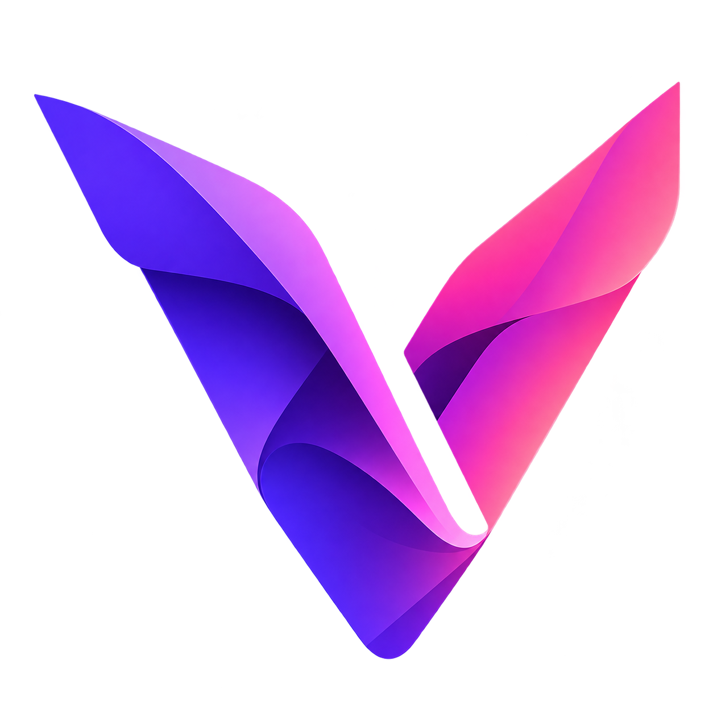

# 🌌 Veyra (`.vey`)

<p align="center">
  
</p>

<p align="center">
  <strong>Native C++20 Speed • Python-Grade Simplicity • Zero GC Stutter • Cross-Platform</strong>
</p>

<p align="center">
  <a href="https://veyra192.vercel.app"></a>
  <a href="https://veyradocs192.vercel.app"></a>
  <a href="LICENSE"></a>
</p>

---

## ⚡ Why Veyra?

**Veyra** is a statically typed systems programming language designed to unite the **effortless syntax and rapid developer velocity of Python** with the **deterministic performance, zero-cost abstractions, and hardware control of C++20/23**.

- **Zero Boilerplate**: Write 1-line top-level scripts or complex engines without mandatory `int main()` wrappers.
- **Pure Native Ahead-of-Time Compilation**: Compiles down to optimized machine code via C++20 with full `-O3`, loop unrolling, and SIMD vectorization.
- **Zero Garbage Collection (RAII)**: Memory and resources are freed deterministically the instant they leave scope. Zero runtime stutter.
- **Direct C/C++ Ecosystem Interop**: Seamlessly include any native C/C++ header (`cinclude <vector>`, `cinclude "raylib.h"`) and embed raw `cpp { ... }` blocks with zero marshalling overhead.
- **Cross-Platform**: First-class support for **Windows 10/11**, **macOS (Apple Silicon & Intel)**, and **Linux**.

---

## 🚀 Quick Installation

### Windows (PowerShell)
```powershell
irm https://veyra192.vercel.app/install.ps1 | iex
```

### Linux & macOS (Terminal)
```bash
curl -fsSL https://veyra192.vercel.app/install.sh | bash
```

### Build from Source (All Platforms)
```bash
git clone https://github.com/IIXII-L192/veyra.git
cd veyra
cmake -B build -DCMAKE_BUILD_TYPE=Release
cmake --build build --config Release -j$(nproc)
sudo cmake --install build
```

---

## 💡 Quick Code Example

```veyra
# Simple, expressive, blazing-fast native execution
let name = "Veyra"
println("Welcome to {name}!")

let mut scores = [88, 95, 74, 99, 82]
sort(scores)
println("Sorted scores: {scores}")

# Object-Oriented Struct with Methods
struct Vec2:
    pub x: double
    pub y: double

    pub fn operator+(self, other: Vec2) -> Vec2:
        return Vec2 { x: self.x + other.x, y: self.y + other.y }

let v1 = Vec2 { x: 10.0, y: 20.0 }
let v2 = Vec2 { x: 5.0, y: 5.0 }
let v3 = v1 + v2
println("v3 = ({v3.x}, {v3.y})")
```

Run directly:
```bash
veyra run app.vey
```

Compile standalone native binary:
```bash
veyra build app.vey -O3 -o app
./app
```

---

## 🎨 Official Brand Assets & Media Kit

All official vector graphics, brand lockups, and wallpapers are available in the [`assets/`](assets/) directory:

| Asset Name | Preview / Description | Direct Link |
| :--- | :--- | :--- |
| **Primary Brand Graphic** | Full color logomark with typography | [`assets/VΞYRΛ full.png`](assets/VΞYRΛ%20full.png) |
| **Vector Logo (White)** | Scalable white SVG for dark backgrounds | [`assets/veyra_logo_white.svg`](assets/veyra_logo_white.svg) |
| **Vector Logo (Black)** | Scalable black SVG for light backgrounds | [`assets/veyra_logo_black.svg`](assets/veyra_logo_black.svg) |
| **Logomark Variations** | 6 color/style variations | [`assets/logo/`](assets/logo/) |
| **Lockup Variations** | 6 logo + text compositions | [`assets/logo_and_text/`](assets/logo_and_text/) |
| **Wordmark Typography** | 6 typographic wordmark styles | [`assets/text/`](assets/text/) |

---

## 📚 Official Links

- **Documentation Portal**: [veyradocs192.vercel.app](https://veyradocs192.vercel.app)
- **Official Website**: [veyra192.vercel.app](https://veyra192.vercel.app)
- **Universal Installer**: [github.com/IIXII-L192/veyra-installer](https://github.com/IIXII-L192/veyra-installer)
